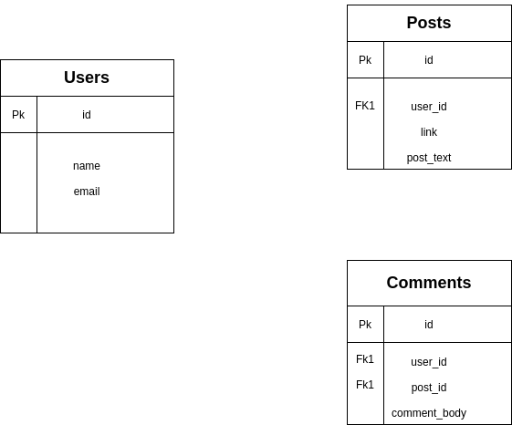

<h1 align="center">*ROR* DB and Active Records/ Micro Reddit </h1>
<p>
  
  <a href="#" target="_blank">
    
  </a>
  <a href="https://twitter.com/kipropJS" target="_blank">
    
  </a>
</p>

## Description of the project

The purpose of this project is to practice Active Record knowledge by building a junior version of Reddit website.

**The project contain database models and schemas for the Reddit website (User, Posts, and comments)**
visit [The Odin Project](https://www.theodinproject.com/courses/ruby-on-rails/lessons/building-with-active-record-ruby-on-rails) for the full project specifications.


<h3 align="center">Model Representation</h3>




### ⭐️ Built with
* Ruby,
* Ruby on Rails,
* SQL lite as the default database


### Dev Environment Requirements:
* Ruby, check [here](https://www.ruby-lang.org/en/documentation/installation/) for more information.

### ⭐️ Running the code

#### Instructions:

1. Clone the Micro edit repo [here](https://github.com/Cyrus-Kiprop/micro-reddit)

2. Navigate into the root of the folder
    ```
    $ cd ./micro-reddit
    ```
3. Run bundle install to install the necessary gems:
    ```
    $ bundle install
    ```
3. Install Yarn
    ```
    $ yarn install --check-files
    ```
3. Migrate the DB
    ```
    $ rails db:migrate
    ```
3. Run the sandboxed console to start creating and removing users, posts or comments
    ```
    $ rails console --sandbox
    ```

## Authors

👤 **Cyrus Kiprop**

- Github: [Cyrus-Kiprop](https://github.com/Cyrus-Kiprop)
- Twitter: [@kipropJS](https://twitter.com/kipropJS)
- Linkedin: [Cyrus Kiprop](https://www.linkedin.com/in/cyrus-kiprop-ba7320120/)


## 🤝 Contributing

Contributions, issues and feature requests are welcome!

Feel free to check the [issues page](https://github.com/Cyrus-Kiprop/well-paid-geek-bot/issues).

## Show your support

Give a ⭐️ if you like this project sanbox

## 📝 License

This project is [MIT](LICENSE) licensed.
